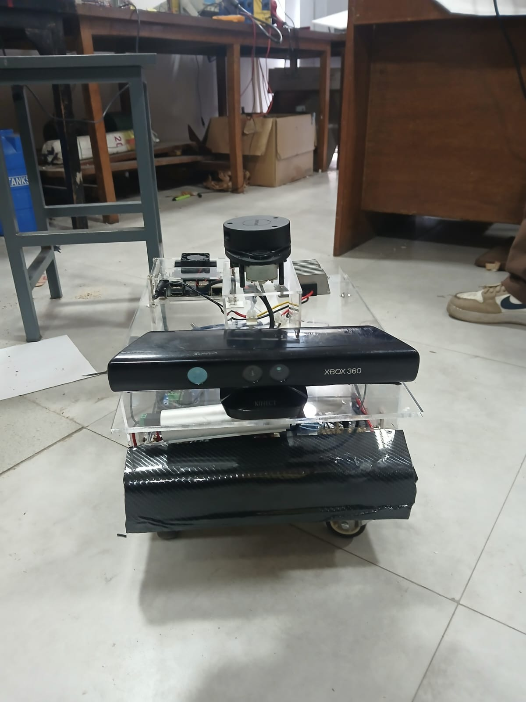
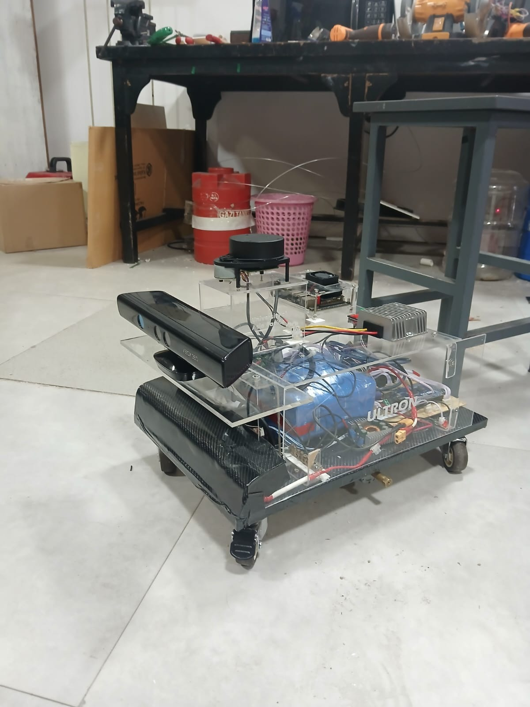
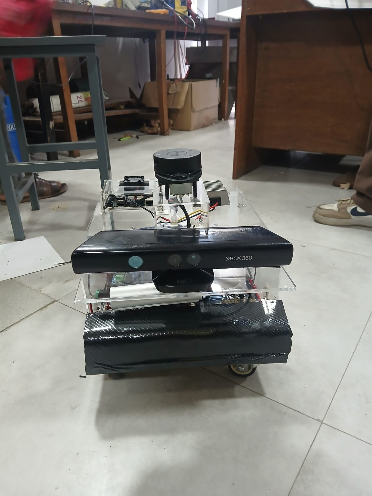
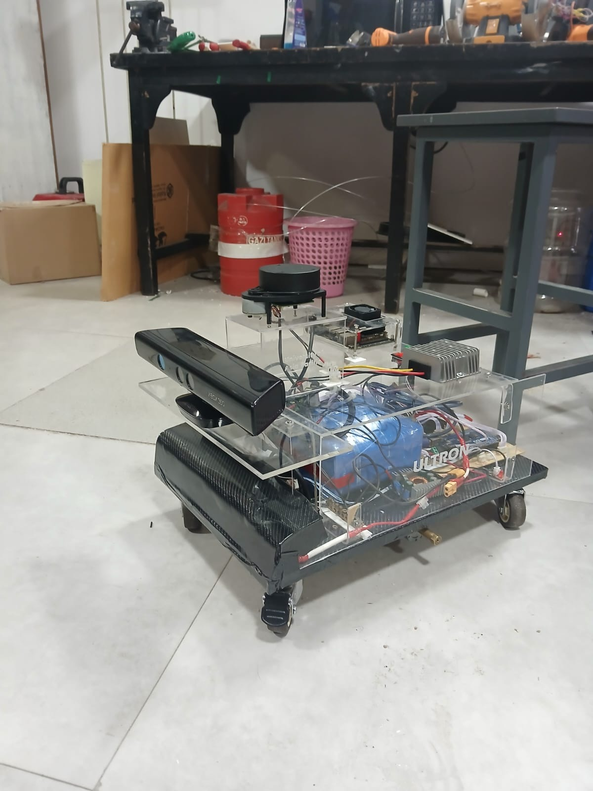
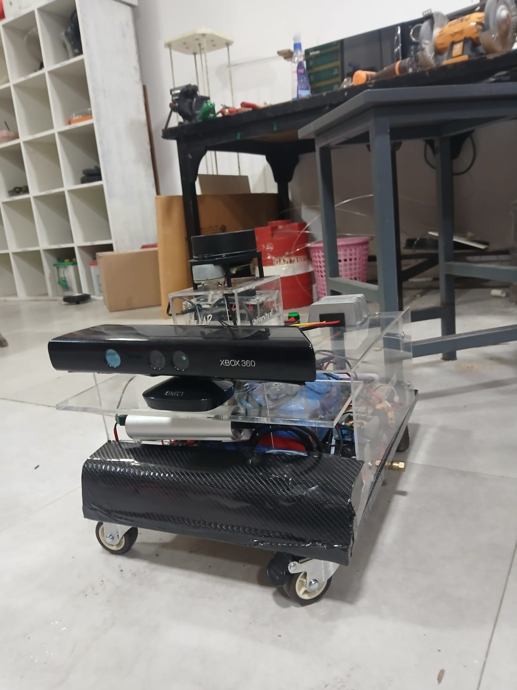
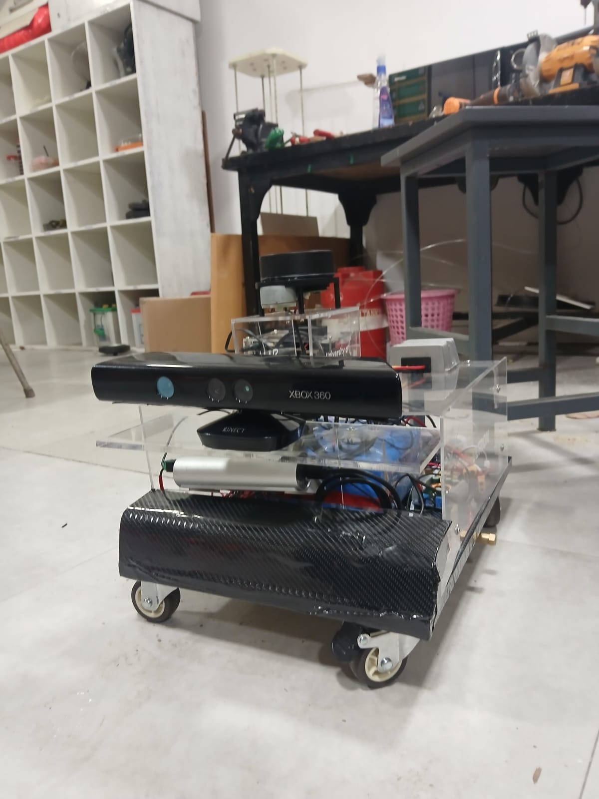
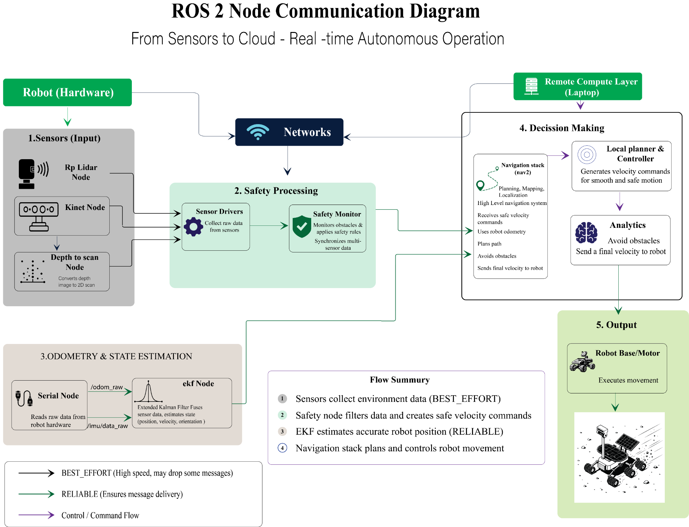

<div align="center">  # Ultron UV  ### A Bangladeshi medical robotics platform — starting with autonomous UV-C disinfection  **Team Ultron UV · University of Asia Pacific · Robotics + AIoT** **Exhibiting at BEAR Summit 2026 → aiming for CES 2027**  [](https://docs.ros.org/en/humble/) [](#our-long-term-goal) [](docs/AI_ARCHITECTURE.md) [](https://supersonic654e-byte.github.io/Ultron-WebApp-Admin-dashboard/#/home) [](#project-status) [](#safety-notice)    *The Ultron UV Version-2 autonomous prototype — depth camera, LiDAR, embedded safety control, and a modular UVC payload, built to be serviced locally.*  </div>  ---  ## Read this in 30 seconds  We are **not building only one robot.** We are building a **local medical robotics platform for Bangladesh**, and starting an **AI journey on Bangladesh's own hospital data.**  - **Version 1 (today):** autonomous **UV-C room disinfection** — Ultron UV. - **Versions 2–4 (roadmap):** environment & logistics → patient-signal monitoring → clinical decision support. - **The bigger goal:** local **manufacturing, software, and service jobs**, plus a **made-in-Bangladesh AI** that learns from local hospital conditions — not a copied foreign model. - **The dream stage:** **BEAR Summit 2026 → CES 2027.**  > [!CAUTION] > Ultron UV is a **research prototype**, not a certified medical device. UV-C can injure eyes and skin. No clinical-efficacy, sterility, or safety claim is made until independent testing and hospital pilots are complete. [Read the safety notice →](docs/SAFETY_AND_LIMITATIONS.md)  ---  ## Our Long-Term Goal  Bangladesh has thousands of health facilities, limited healthcare resources, and a serious shortage of nurses. A 2025 Health Sector Reform Commission estimate reported an **82% nursing shortfall**. Imported hospital robots are expensive and hard to maintain locally.  Ultron exists to change that. Our long-term goal is to create:  | Pillar | What it means | |---|---| | 🏭 **Local manufacturing** | A robot that can be built and assembled in Bangladesh, not just imported | | 💻 **Software jobs** | ROS 2 autonomy, cloud dashboards, data engineering, and eventually AI/ML | | 🔧 **Service jobs** | Local technicians, spare-parts supply, and maintenance contracts | | 🏥 **Practical hospital technology** | Affordable, serviceable, designed for narrow corridors and limited infrastructure | | 🧠 **Bangladesh's own AI** | An AI built slowly on **our own hospital data**, for our own conditions |  We start with small pilots, prove safety and value, then scale step by step.  ---  ## The Four Robot Versions  The robot platform is designed to grow. Version 1 is what we exhibit today; the later versions are the roadmap.  ```mermaid flowchart LR     V1["<b>V1 · Ultron UV</b><br/>UVC room disinfection<br/><i>(today)</i>"]:::now --> V2["<b>V2</b><br/>Environment +<br/>logistics"]:::next     V2 --> V3["<b>V3</b><br/>Patient-signal<br/>monitoring"]:::next     V3 --> V4["<b>V4</b><br/>Clinical decision<br/>support + AI"]:::future     classDef now fill:#0B5CAD,color:#fff,stroke:#0B5CAD;     classDef next fill:#E3F2FD,color:#0B5CAD,stroke:#0B5CAD;     classDef future fill:#E8F5E9,color:#2E7D32,stroke:#2E7D32; ```  | Version | Capability | Status | |---|---|---| | **V1 — Ultron UV** | UVC-assisted room disinfection after manual cleaning | 🟠 Research prototype — exhibited at BEAR Summit 2026 | | **V2** | Environment monitoring (CO₂, humidity, occupancy) + carrying selected supplies | 🗓️ Roadmap | | **V3** | Monitor approved patient signals (fever, SpO₂, falls) and alert staff | 🗓️ Roadmap | | **V4** | Clinical decision support + controlled medicine delivery, powered by the AI layer | 🗓️ Roadmap |  > The robot will **assist** healthcare workers. It will **not** replace doctors or nurses.  ---  ## The AI Layer — Bangladesh's Own Hospital Data  This is the part of the vision that goes beyond a lamp on wheels. Ultron follows the **same pattern every major AI company uses** — collect data → find patterns → make predictions — but trained on **Bangladeshi hospital realities**.  ```mermaid flowchart TD     A["<b>V1 · Disinfection data</b><br/>'UV reduced pathogens 340 → 10/cm³'"] --> DB[(Hospital<br/>database)]     B["<b>V2 · Environment + logistics</b><br/>'High CO₂ + high occupancy = risk'"] --> DB     C["<b>V3 · Patient signals</b><br/>fever, SpO₂, falls"] --> DB     DB --> P["<b>V4 · AI prediction</b><br/>'87% outbreak risk in 48h → order antibiotics, raise UV'"]     P -.->|learn from outcome| DB ```  | | Tesla (autonomous driving) | Ultron (hospital infection) | |---|---|---| | Collects | Camera + radar + lidar | Environment + patient + disinfection data | | Learns | "this road pattern → pedestrian → brake" | "this pattern → infection outbreak → isolate + treat" | | Predicts | Brakes before the human sees | Acts before the outbreak spreads |  **Same principle. Different domain. Built for Bangladesh, on Bangladesh's data.**  ➡️ **Full plain-language explanation:** [docs/AI_ARCHITECTURE.md](docs/AI_ARCHITECTURE.md)  ---  ## Live Demos  We have built working, interactive web interfaces for both sides of the system.  | Admin command & data dashboard | Robot operator dashboard | |---|---| | [](https://supersonic654e-byte.github.io/Ultron-WebApp-Admin-dashboard/#/home) |  | | A live demo of the hospital-side operations platform: fleet status, disinfection logs, and the data-collection surface that feeds the AI layer. | The operator interface for driving and supervising the robot, viewing live telemetry, and running a disinfection cycle. |  🎬 **See it move:** [Watch the Ultron UV project video on YouTube →](https://youtu.be/kQccZabbFyI?si=BuHTrbYDEwzOPGF8)  ---  ## Project Status  The repository deliberately separates **built**, **testing**, and **planned** capabilities so visitors, judges, mentors, and investors can evaluate the project honestly.  | Capability | Current status | Evidence | |---|---|---| | Version-2 autonomous base (depth + LiDAR + embedded control) | **Built**, under integration | [Gallery photos](#prototype-gallery) | | UV-C payload (modular) | Earlier prototype built; V2 integration planned | Prototype photos | | ROS 2 system architecture | Designed and under development | [Architecture docs](docs/ARCHITECTURE.md) | | Admin data-collection dashboard | **Live demo** | [Open dashboard →](https://supersonic654e-byte.github.io/Ultron-WebApp-Admin-dashboard/#/home) | | Operator control dashboard | **UI built** | [Screenshot](docs/assets/dashboards/user-dashboard.png) | | SLAM / Nav2 autonomous route execution | Testing stage; public test matrix pending | [Test matrix](docs/TESTING.md) | | Human-presence safety shutdown | Design stage; validation required | [Safety docs](docs/SAFETY_AND_LIMITATIONS.md) | | AI prediction layer | **Roadmap** — data collection begins with V1 | [AI architecture](docs/AI_ARCHITECTURE.md) | | Hospital pilot & regulatory validation | Not completed | Future milestone |  ---  ## Prototype Gallery  <table>   <tr>     <td width="33%" align="center"><b>Front-right</b><br/></td>     <td width="33%" align="center"><b>Front</b><br/></td>     <td width="33%" align="center"><b>Side</b><br/></td>   </tr>   <tr>     <td align="center"><b>Sensor detail</b><br/></td>     <td align="center"><b>Rear</b><br/></td>     <td align="center"><b>Top-down</b><br/></td>   </tr> </table>  <details> <summary><b>Earlier prototype platforms & architecture diagrams</b></summary>  | | | |---|---| |  |  | | Early UV-C tower hardware with sensors and control box. | Earlier mobile navigation base. | |  |  | | UV-C hardware and autonomous sensing platform together. | Edge vs. remote compute split. | |  |  | | ROS 2 node communication. | Five-layer system overview. |  </details>  ---  ## Target Workflow (Version 1)  ```mermaid flowchart LR     A[Empty room after manual cleaning] --> B[Map & route planning]     B --> C[Human & obstacle checks]     C --> D{Area clear?}     D -- No --> E[Stop · wait · alert · re-plan]     D -- Yes --> F[Supervised UV-C cycle]     F --> G[Safety monitoring]     G --> H{Human detected?}     H -- Yes --> I[UV-C off · robot stop]     H -- No --> J[Log cycle & return] ```  ## Technology Stack  | Area | Tools and components | |---|---| | Robotics middleware | ROS 2 Humble | | Navigation | Nav2, SLAM Toolbox, RViz2 | | State estimation | `robot_localization` EKF | | Edge compute | NVIDIA Jetson class | | Embedded control | Arduino Mega 2560 | | Sensors | RPLidar, depth camera, MPU6050 IMU, wheel encoders | | Communication | Zenoh-based ROS 2 routing over private transport | | Operator & admin UIs | Web dashboards (live demo) | | Languages | Python, C/C++, Bash, YAML |  ---  ## Safety Notice  > [!CAUTION] > UV-C radiation can injure eyes and skin. Ultron UV must **not** be operated with UV-C lamps energized in occupied environments unless qualified safety controls, interlocks, supervision, and institutional approval are in place.  Safety is **layered** and must be **tested** — it can never be called "100% safe": person detection · warning lights & sound · emergency stop · restricted-room operation · automatic lamp shutdown.  ➡️ [Safety and limitations →](docs/SAFETY_AND_LIMITATIONS.md)  ---  ## Business Model & Roadmap  **A realistic revenue path — built in phases, not promises.**  | Phase | Goal | |---|---| | **Phase 1** | Validation in **3–5 hospitals** | | **Phase 2** | **20–30** paid or subsidized deployments + maintenance & dashboard services | | **Phase 3** | Larger national sales, then regional export — **after** safety, quality, and regulatory requirements are met |  Revenue can come from robot sales, annual maintenance, cloud services, upgrades, and future modules.  > Our current **cost target** is **Tk 146,000** for the base robot + **Tk 42,000** for the UVC module (**Tk 188,000** total). This is a *target based on the present design*, not a final certified selling price.  | Period | Milestone | |---|---| | 2026 | BEAR Summit prototype demonstration; publish public-safe test evidence; refine safety architecture | | 2027 | Target: **CES 2027** global showcase; controlled hospital-like pilot testing; UV-C safety validation | | 2028–2031 | Multi-ward deployment research, fleet coordination, maintenance model, commercialization prep | | 2032+ | Regional infection-control robotics platform with analytics, service partnerships, and export |  ➡️ [CES 2027 & funding strategy →](docs/CES_AND_FUNDING_STRATEGY.md)  ---  ## Why Ultron Is Different (Bangladesh Focus)  Many imported hospital robots are **expensive and difficult to maintain locally**. Ultron's advantage is **not only** lower target cost. It is being designed for:  - 🏥 **Narrow corridors** and limited infrastructure - 🔩 **Local spare parts** and **local technicians** - 👩‍⚕️ **Bangladeshi hospital workflows** - 📈 An industry that is **early-stage** — we don't claim "zero competition"; we claim we're helping **build** the sector.  ---  ## Documentation  | Document | What's inside | |---|---| | 🧠 [AI Architecture](docs/AI_ARCHITECTURE.md) | How Ultron builds Bangladesh's own AI on hospital data | | 🖥️ [Live Demos](docs/LIVE_DEMOS.md) | Admin & operator dashboards, and how they connect | | 🏗️ [System Architecture](docs/ARCHITECTURE.md) | Public-safe edge/remote compute split, ROS 2 nodes | | 🛟 [Safety & Limitations](docs/SAFETY_AND_LIMITATIONS.md) | UV-C + mobile-robot safety, honest known limitations | | 🧪 [Test Matrix](docs/TESTING.md) | What will be measured before any performance claim | | 🎤 [Exhibition Playbook](docs/EXHIBITION_PLAYBOOK.md) | 30-sec pitch, booth FAQ, judge Q&A | | 🚀 [CES 2027 & Funding Strategy](docs/CES_AND_FUNDING_STRATEGY.md) | Readiness gaps, funding path, 90-day plan | | 📦 [Installation](docs/INSTALLATION.md) | Public setup workflow & secret management | | 🔁 [Development Process](docs/DEVELOPMENT_PROCESS.md) | How the project was built | | 📰 [Publication Matrix](docs/PUBLICATION_MATRIX.md) | What's safe to publish vs. kept private | | 📋 [Publishing Checklist](docs/PUBLISHING_CHECKLIST.md) | Privacy & security checklist | | 📄 [Project speech (9-point)](https://github.com/supersonic654e-byte/Ultron-UV-/tree/redesign/bear-summit-2026-update#readme) | The BEAR Summit pitch this repo supports |  ---  ## Current Ask  We are looking for:  - 🏥 Healthcare mentors for infection-control workflow review - 🤖 Robotics mentors for navigation, safety, and reliability testing - ☢️ UV-C / electrical safety reviewers for safe validation planning - 🧪 Hospital or lab partners for **controlled non-clinical pilot** environments - 💼 Startup & grant advisors for productization, costing, and regulatory strategy  ---  ## Team  **Team Ultron UV** Primary institution: **University of Asia Pacific** Contact: use **GitHub Issues** for public questions.  <div align="center">  ---  ### BEAR Summit 2026 → CES 2027  **Built in Bangladesh. Designed for Bangladeshi healthcare.** *Not a copied model — a platform we are building, step by step, on our own data.*  </div>