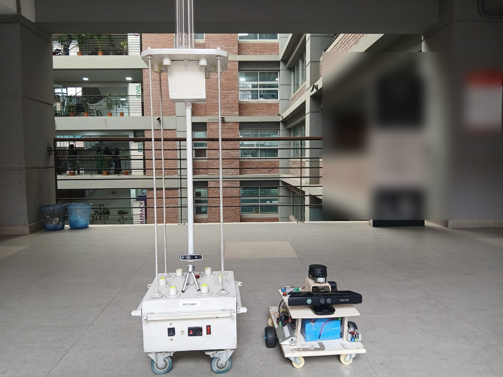
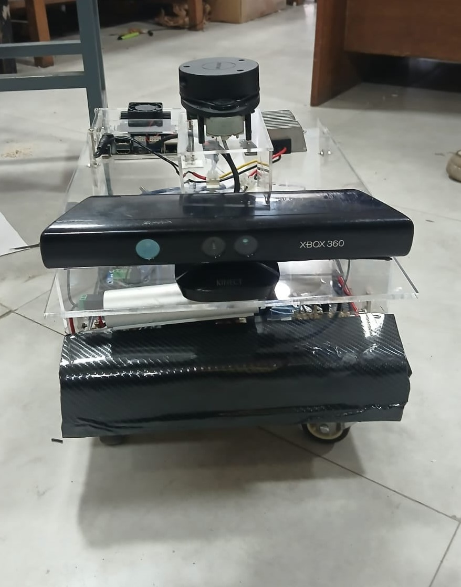
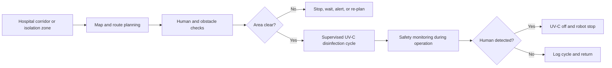

<div align="center">

# Ultron UV

### Low-cost autonomous UV-C disinfection robotics for safer healthcare environments

**Team Supersonic UAP · University of Asia Pacific · Robotics + AIoT**

[](https://docs.ros.org/en/humble/)
[](#project-status)
[](#safety-notice)
[](https://bear-summit-2026.vercel.app/)
[](https://www.youtube.com/watch?v=kQccZabbFyI)
[](LICENSE_NOTICE.md)



*A UV-C tower platform and autonomous sensing/navigation prototype shown together during development.*

</div>

---

## Navigation

- [One-line Summary](#one-line-summary)
- [Problem](#problem)
- [Proposed Solution](#proposed-solution)
- [Project Status](#project-status)
- [Project Video](#project-video)
- [Prototype Gallery](#prototype-gallery)
- [Target Workflow](#target-workflow)
- [Technology Stack](#technology-stack)
- [Safety Notice](#safety-notice)
- [Repository Structure](#repository-structure)
- [Documentation](#documentation)
- [Roadmap](#roadmap)
- [Current Ask](#current-ask)
- [Team](#team)
- [License](#license)

---

## One-line Summary

Ultron UV is a research prototype for an autonomous hospital disinfection robot that combines ROS 2 navigation, LiDAR/depth sensing, embedded safety control, and UV-C disinfection hardware to reduce manual exposure in high-risk indoor healthcare areas.

## Problem

Hospitals and clinics need frequent, repeatable disinfection of corridors, isolation zones, emergency areas, and patient-contact routes. Manual chemical disinfection is labor-intensive and can repeatedly expose cleaning staff and healthcare workers to contaminated environments.

This matters especially in resource-constrained settings where imported disinfection robots are expensive, maintenance support is limited, and infection-control teams are under pressure during outbreaks.

## Proposed Solution

Ultron UV is being developed as a locally maintainable autonomous platform that can:

- Map indoor corridor-like environments.
- Navigate through predefined disinfection routes.
- Detect obstacles and nearby humans.
- Disable UV-C output when human presence is detected.
- Support manual override and supervised operation.
- Keep the architecture modular so hospitals can service and upgrade the system locally.

The project is currently a research and exhibition prototype. It is not a certified medical device and has not completed clinical efficacy validation.

## Project Status

| Capability | Current status | Evidence |
|---|---|---|
| UV-C tower hardware | Built as an earlier prototype | Prototype photos |
| Mobile sensing/navigation platform | Built and under integration | Prototype photos |
| ROS 2 system architecture | Designed and under development | Architecture diagrams |
| LiDAR/depth/IMU/encoder integration | Integration stage | Hardware photos and node plan |
| SLAM/localization/Nav2 workflow | Testing stage | Public test matrix pending |
| Human-presence safety shutdown | Design stage; validation required | Safety plan |
| Autonomous UV-C route execution | Planned integration | Roadmap |
| Hospital pilot and regulatory validation | Not completed | Future milestone |

The repository deliberately separates built, testing, and planned capabilities so visitors, judges, mentors, and investors can evaluate the project honestly.

## Project Video

[](https://www.youtube.com/watch?v=kQccZabbFyI)

**[▶ Watch the Ultron UV project video](https://www.youtube.com/watch?v=kQccZabbFyI)** — autonomous navigation, sensor integration, and UV-C platform walkthrough.

> Filmed by Team Supersonic UAP. See the [Exhibition Playbook](docs/EXHIBITION_PLAYBOOK.md) for the pitch that accompanies this demo.

## Prototype Gallery

| UV-C tower | Autonomous base |
|---|---|
|  |  |
| Early UV-C disinfection hardware with tower, sensors, and control box. | Mobile platform with depth camera, LiDAR, embedded controller, and edge-compute hardware. |

| Two-platform direction | Architecture overview |
|---|---|
|  |  |
| UV-C hardware and autonomous sensing platform shown together. | Edge and remote compute split for practical ROS 2 development. |

Additional platform photos are available in [`docs/assets/gallery/`](docs/assets/gallery/).

## Target Workflow



## Technology Stack

| Area | Tools and components |
|---|---|
| Robotics middleware | ROS 2 Humble |
| Navigation | Nav2, SLAM Toolbox, RViz2 |
| State estimation | `robot_localization` EKF |
| Edge compute | NVIDIA Jetson Nano |
| Embedded control | Arduino Mega 2560 |
| Sensors | RPLidar, depth camera, MPU6050 IMU, wheel encoders |
| Communication | Zenoh-based ROS 2 routing over private transport |
| Languages | Python, C/C++, Bash, YAML |

## Safety Notice

> [!CAUTION]
> UV-C radiation can injure eyes and skin. Ultron UV must not be operated with UV-C lamps energized in occupied environments unless qualified safety controls, interlocks, supervision, and institutional approval are in place.

This repository makes no claim of clinical efficacy, sterilization performance, regulatory approval, or production readiness. Public documentation avoids publishing private credentials, real deployment maps, restricted calibration values, and safety-critical implementation details.

See [Safety and Limitations](docs/SAFETY_AND_LIMITATIONS.md) for the full statement.

## Repository Structure

```text
Ultron-UV-/
|-- README.md                     # Project overview (this file)
|-- CHANGELOG.md                  # Version history
|-- CONTRIBUTING.md               # Contribution and review rules
|-- SECURITY.md                   # Security and disclosure policy
|-- PRIVACY.md                    # Data and privacy commitments
|-- LICENSE_NOTICE.md             # License and IP status
|-- .env.example                  # Placeholder configuration only
|-- docs/
|   |-- README.md                 # Documentation index
|   |-- ARCHITECTURE.md           # Public system architecture
|   |-- AI_ARCHITECTURE.md        # AI layer roadmap
|   |-- SAFETY_AND_LIMITATIONS.md # Safety scope and known limits
|   |-- TESTING.md                # Test evidence matrix
|   |-- INSTALLATION.md           # Setup and secret-management guide
|   |-- LIVE_DEMOS.md             # Admin and operator dashboards
|   |-- DEVELOPMENT_PROCESS.md    # How the team works
|   |-- PUBLICATION_MATRIX.md     # Public-vs-private content rules
|   |-- PUBLISHING_CHECKLIST.md   # Pre-publication checklist
|   |-- EXHIBITION_PLAYBOOK.md    # Pitch, booth FAQ, follow-up
|   |-- CES_AND_FUNDING_STRATEGY.md # Funding and CES 2027 plan
|   `-- assets/                   # Diagrams, gallery, poster, photocard
`-- scripts/
    `-- prepublish_check.sh       # Scans for secrets/PII before publishing
```

## Documentation

| Document | Purpose |
|---|---|
| [Architecture](docs/ARCHITECTURE.md) | Public-safe system architecture and compute split |
| [AI Architecture](docs/AI_ARCHITECTURE.md) | The roadmap AI layer and data story |
| [Safety & Limitations](docs/SAFETY_AND_LIMITATIONS.md) | Safety scope, known limits, claims policy |
| [Testing](docs/TESTING.md) | Public test-evidence matrix |
| [Installation](docs/INSTALLATION.md) | Platform requirements and secret management |
| [Live Demos](docs/LIVE_DEMOS.md) | Admin and operator dashboards |
| [Development Process](docs/DEVELOPMENT_PROCESS.md) | Team workflow and standards |
| [Publication Matrix](docs/PUBLICATION_MATRIX.md) | What may and may not be published |
| [Exhibition Playbook](docs/EXHIBITION_PLAYBOOK.md) | 30-second pitch, booth FAQ, follow-up script |
| [CES & Funding Strategy](docs/CES_AND_FUNDING_STRATEGY.md) | Post-BEAR planning and funding path |

## Roadmap

| Period | Milestone |
|---|---|
| 2026 | Complete BEAR Summit prototype demonstration, publish public-safe test evidence, and refine safety architecture |
| 2027–2028 | Controlled hospital-like pilot testing, UV-C safety validation, workflow studies, and prototype cost optimization |
| 2029–2031 | Multi-ward deployment research, fleet coordination, maintenance model, and commercialization preparation |
| 2032–2036 | Regional infection-control robotics platform with analytics, service partnerships, and export potential |

## Current Ask

We are looking for:

- Healthcare mentors for infection-control workflow review.
- Robotics mentors for navigation, safety, and reliability testing.
- UV-C/electrical safety reviewers for safe validation planning.
- Hospital or lab partners for controlled non-clinical pilot environments.
- Startup and grant advisors for productization, costing, and regulatory strategy.

## Team

**Team Supersonic UAP** — University of Asia Pacific, Bangladesh.

Team members: Sadnan · Tazin · Akib.

Contact: use GitHub Issues for public questions.

## License

No open-source license has been selected. All source code, firmware, documentation, diagrams, photographs, and designs are **all rights reserved** until ownership and release permissions are confirmed. See [LICENSE_NOTICE.md](LICENSE_NOTICE.md).

---

<div align="center">

**Built in Bangladesh. Designed for safer healthcare environments.**

</div>
