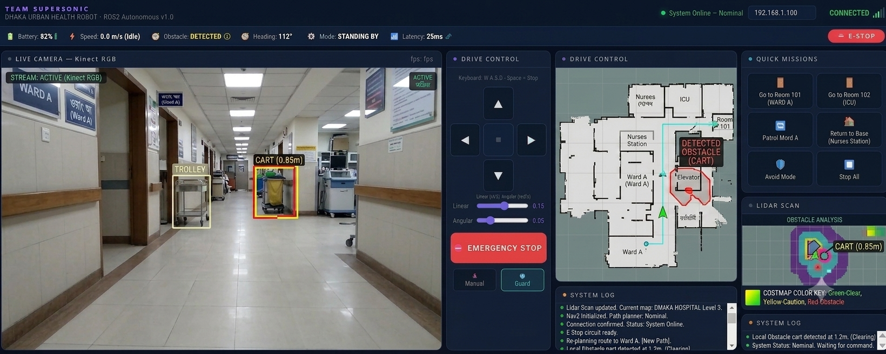
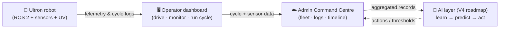

# Live Demos — Admin & Operator Dashboards

Ultron UV is more than a robot. It is a **robot + cloud platform**. We have built two working, interactive web interfaces that together let a hospital **operate** the robot and **collect the data** that feeds the [AI layer](AI_ARCHITECTURE.md).

> Both demos below are **front-end demonstrations**. They show the interface and the data model; live robot telemetry is shown when a physical unit is connected.

---

## 1. Admin Command & Data Dashboard (live)

🟢 **Open it:** [https://supersonic654e-byte.github.io/Ultron-WebApp-Admin-dashboard/#/home](https://supersonic654e-byte.github.io/Ultron-WebApp-Admin-dashboard/#/home)

This is the **hospital-side** operations platform — the "Supersonic Command Centre." It is the surface through which a hospital admin:

- sees the **fleet status** of every Ultron unit,
- reviews **disinfection logs** (which room, when, for how long),
- watches the **operations timeline** for the day,
- and, most importantly for the AI roadmap, **feeds the data-collection pipeline** that the prediction model will learn from.

<b>What this dashboard demonstrates</b>

- A real, working **operator-grade UI** — not a mockup slide.
- The **data schema** that V1 disinfection records will use (room, dose-time, cycle, outcome).
- The connection between **what the robot does** and **what the AI will later learn from**.

---

## 2. Robot Operator Dashboard

This is the **operator-side** interface — what the person supervising the robot uses to **drive, monitor, and run a disinfection cycle**.

It shows, for the connected robot:

- live **telemetry** (battery, sensors, position),
- **manual / autonomous** control modes,
- **disinfection-cycle** start / stop,
- and the **safety indicators** (human-presence, UV state, emergency stop).

> The operator dashboard is currently a **built UI** connected to a live ROS 2 unit during testing; the public screenshot above is sanitized.

---

## How the two connect

- The **operator** runs the robot and produces records.
- The **admin** dashboard collects, stores, and visualizes those records across the fleet.
- The **AI layer** (roadmap) learns from that accumulated data to predict and recommend.

---

## See the robot in action

🎬 **Project video:** [https://youtu.be/kQccZabbFyI](https://youtu.be/kQccZabbFyI)
