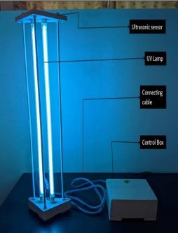
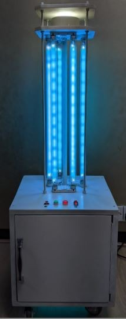
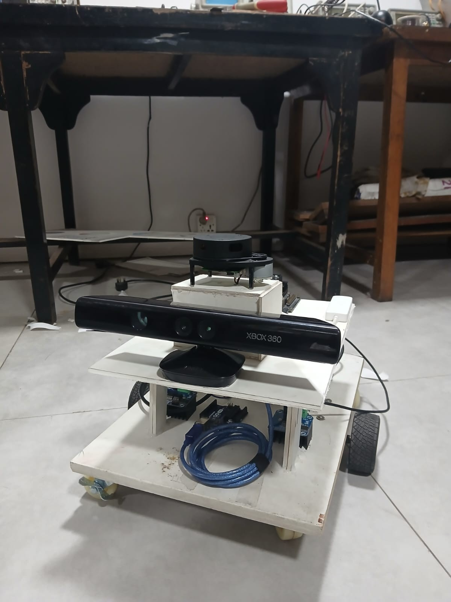
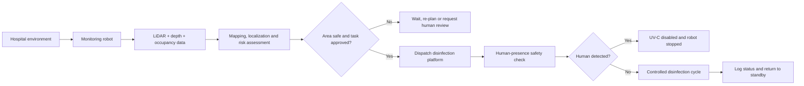
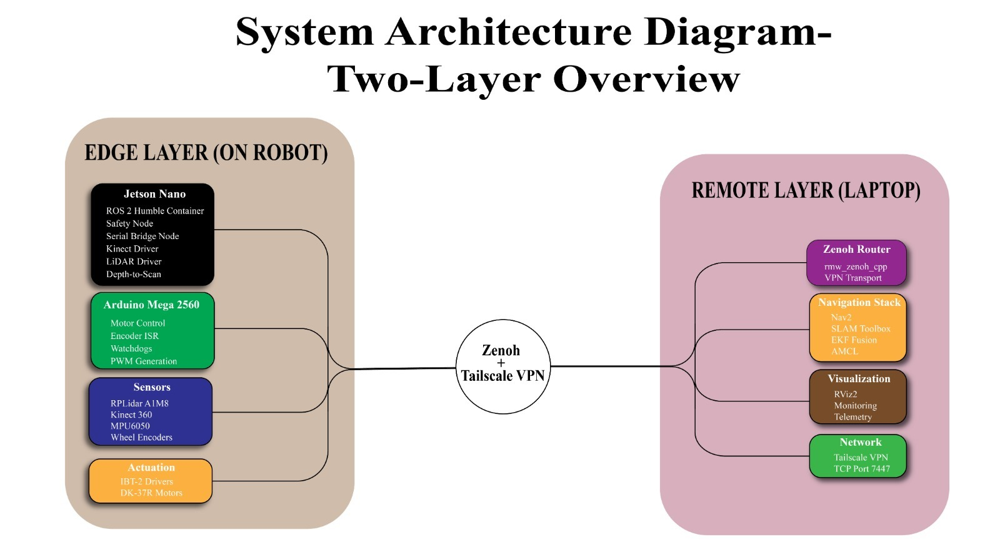
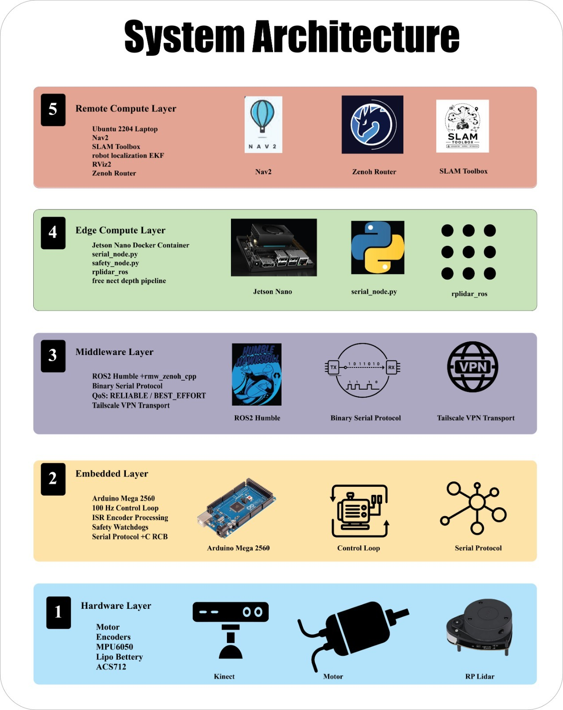

<div align="center">

# Ultron UV

### Autonomous Swarm-Robot Research Platform for Hospital Monitoring and Multi-Modal UV-C Disinfection

**Team Supersonic-UAP · Robotics + AIoT**

[](https://docs.ros.org/en/humble/)
[](#technology-stack)
[](#technology-stack)
[](#project-status)
[](#safety-notice)


*A mobile UV-C platform and an autonomous sensing/navigation prototype developed as the physical foundation of the Ultron UV concept.*

</div>

---

## Project Overview

Ultron UV explores how locally developed autonomous robots can support safer and more consistent infection-control workflows in hospitals and other indoor healthcare environments.

The target system separates the workflow into two cooperating platforms:

1. **Monitoring and navigation robot** — maps the environment, observes occupancy and obstacles, and supports risk-aware task planning.
2. **Disinfection robot** — performs controlled UV-C disinfection after safety conditions are satisfied.

The current work combines an autonomous mobile base, ROS 2 navigation architecture, LiDAR and depth sensing, embedded motor control, local fail-safe logic, and a previously developed UV-C hardware platform. **Autonomous robot-to-robot coordination and hospital deployment remain under development and validation.**

## Why This Project Exists

Manual disinfection can be labor-intensive, inconsistent, and may expose cleaning personnel to contaminated areas. Imported hospital robots are often costly and difficult to maintain in resource-constrained settings.

Ultron UV is designed around three principles:

- **Local affordability:** modular hardware and locally serviceable components.
- **Operational safety:** human-presence checks, local command gating, watchdogs, and network-loss shutdown behavior.
- **Scalable autonomy:** a layered architecture that can evolve from one mobile robot into coordinated monitoring and disinfection platforms.

## Project Status

| Capability | Status | Public evidence |
|---|---|---|
| Differential-drive mobile base | **Prototype built** | Prototype photographs |
| LiDAR and depth-camera hardware integration | **Prototype built / integration ongoing** | Navigation-base photographs and architecture diagrams |
| ROS 2 edge/remote architecture | **Designed and substantially developed** | ROS 2 communication and two-layer diagrams |
| Embedded motor, encoder, watchdog, and emergency-stop design | **Developed; validation ongoing** | Public-safe architecture documentation |
| SLAM, localization, Nav2, and RViz workflow | **Integration and testing stage** | Architecture and node-flow diagrams |
| Standalone UV-C hardware platform | **Earlier prototype built** | UV tower and mobile-unit photographs |
| UV-C module integration with autonomous base | **Planned / not publicly validated** | Roadmap |
| Human-presence safety validation | **Planned / testing required** | Roadmap |
| Robot-to-robot dispatch | **Planned** | Target architecture |
| AI occupancy and infection-risk scoring | **Planned** | Target architecture |
| Hospital pilot and clinical efficacy validation | **Not completed** | Future roadmap |

> The repository deliberately separates **built**, **under test**, and **planned** capabilities. It does not present roadmap features as completed results.

## Prototype Gallery

<table>
<tr>
<td width="50%" align="center">
<br/>
<strong>UV-C tower prototype</strong><br/>
Early hardware showing the lamp tower, ultrasonic sensing, control box, and connecting cable.
</td>
<td width="50%" align="center">
<br/>
<strong>Mobile UV-C unit</strong><br/>
Earlier wheeled disinfection platform used as a technical foundation for the current project.
</td>
</tr>
<tr>
<td width="50%" align="center">
<br/>
<strong>Autonomous navigation base</strong><br/>
Mobile platform with depth camera, LiDAR, embedded controller, and edge-compute hardware.
</td>
<td width="50%" align="center">
<br/>
<strong>Two-platform development direction</strong><br/>
UV-C hardware and the sensing/navigation base shown together during prototype development.
</td>
</tr>
</table>

## Target System Workflow



> This diagram represents the **target product workflow**. AI risk scoring, coordinated dispatch, and autonomous UV-C operation are not yet publicly validated.

## ROS 2 Node Communication


The current ROS 2 design moves data from sensors through local safety processing and state estimation before navigation commands reach the motor controller.

### High-level data path

```text
LiDAR / Depth Camera / IMU / Encoders
                 │
                 ▼
       Sensor Drivers and Serial Bridge
                 │
                 ▼
      Safety Monitor and State Estimation
                 │
                 ▼
       SLAM / Localization / Nav2 Planner
                 │
                 ▼
          Safe Velocity Command
                 │
                 ▼
        Arduino Motor-Control Layer
```

## Two-Layer Compute Architecture



| Layer | Responsibilities |
|---|---|
| **Edge layer — on robot** | Sensor acquisition, serial communication, motor control, command filtering, watchdogs, and local safety enforcement |
| **Remote compute layer — laptop/workstation** | SLAM, localization, path planning, RViz visualization, telemetry, and supervisory control |
| **Secure transport** | Zenoh-based ROS 2 routing over a private encrypted network |

The split architecture keeps hardware-facing safety behavior close to the robot while moving heavier navigation workloads away from the resource-constrained edge computer.

<details>
<summary><strong>View the five-layer architecture</strong></summary>
<br/>

</details>

## Technology Stack

| Domain | Technologies and components |
|---|---|
| Robotics middleware | ROS 2 Humble |
| Navigation | Nav2, SLAM Toolbox |
| State estimation | `robot_localization` EKF |
| Edge compute | NVIDIA Jetson Nano |
| Embedded control | Arduino Mega 2560 |
| Sensors | RPLidar, Kinect/depth camera, MPU6050 IMU, wheel encoders |
| Programming | Python, C/C++, Bash, YAML |
| Deployment | Docker and Docker Compose |
| Communication | `rmw_zenoh_cpp`, Zenoh, private VPN transport |
| Visualization | RViz2 and ROS 2 command-line tools |

## Core Design Features

- **Layered autonomy:** embedded, edge, middleware, remote-compute, and application responsibilities are separated.
- **Local safety authority:** the robot can reject or stop unsafe motion even when remote commands are present.
- **Network-loss protection:** command and heartbeat timeouts are designed to stop the mobile base when communication is lost.
- **Multi-sensor navigation:** LiDAR, depth data, IMU, and wheel odometry support mapping and localization.
- **Modular development:** UV-C hardware, sensing, navigation, and future AI modules can be tested independently.
- **Public/private separation:** credentials, network endpoints, safety calibration, facility maps, and proprietary implementation details are excluded from this repository.

## Engineering Challenges and Responses

| Engineering challenge | Design response |
|---|---|
| Jetson Nano compute and memory limits | Moved SLAM, Nav2, EKF, and visualization to a remote compute layer |
| ROS 2 communication across separate networks | Used Zenoh routing over an encrypted private network |
| Mixed sensor timing and QoS requirements | Defined explicit data-flow and timeout handling for safety-critical streams |
| Motor safety during software or network failure | Added local watchdog, heartbeat, emergency-stop, and command-timeout concepts |
| Heavy depth-image processing | Converted the depth stream into a navigation-focused scan representation |
| Avoiding exaggerated project claims | Clearly separated implemented, under-test, and roadmap functions |

## Repository Contents

```text
ultron-uv-public-repository/
├── README.md
├── .env.example
├── .gitignore
├── CHANGELOG.md
├── CONTRIBUTING.md
├── LICENSE_NOTICE.md
├── PRIVACY.md
├── SECURITY.md
├── docs/
│   ├── ARCHITECTURE.md
│   ├── DEVELOPMENT_PROCESS.md
│   ├── INSTALLATION.md
│   ├── PUBLICATION_MATRIX.md
│   ├── PUBLISHING_CHECKLIST.md
│   ├── SAFETY_AND_LIMITATIONS.md
│   ├── TESTING.md
│   └── assets/
│       ├── dual-prototype-platforms.jpg
│       ├── navigation-base-prototype.jpg
│       ├── uv-mobile-unit.jpg
│       ├── uv-tower-labeled.jpg
│       ├── ros2-node-communication.png
│       ├── two-layer-architecture.jpg
│       └── five-layer-architecture.jpg
└── scripts/
    └── prepublish_check.sh
```

This is currently a **public documentation and portfolio repository**. Full deployment credentials, private network settings, facility maps, raw datasets, safety calibration, and unreviewed proprietary code are intentionally excluded.

## Installation and Running

Clone the public repository:

```bash
git clone https://github.com/supersonic654e-byte/ultron-uv.git
cd ultron-uv
cp .env.example .env
```

The current public package focuses on documentation and reviewed public-safe assets. Follow [the installation guide](docs/INSTALLATION.md) for the approved environment structure and for the steps that will apply when sanitized source modules are released.

**Never commit the real `.env` file.** Keep API keys, VPN endpoints, MQTT credentials, database URLs, and device-specific secrets in local environment variables or a secrets manager.

## Testing Approach

Testing is divided into independent safety and engineering layers:

- Serial-protocol and configuration validation
- ROS 2 topic, QoS, and TF verification
- Encoder, IMU, and odometry checks
- Sensor-timeout and network-loss shutdown tests
- Mapping and waypoint-navigation trials
- Hardware emergency-stop and motor-direction tests
- Separate controlled UV-C safety testing by qualified personnel

See [docs/TESTING.md](docs/TESTING.md) for the public test matrix.

## Roadmap

- **2026:** Functional prototype demonstration and integration testing
- **2027–2028:** Controlled pilot testing, safety validation, and hospital-workflow studies
- **2029–2031:** Product optimization, cost reduction, and multi-ward deployment research
- **2032–2036:** Multi-floor swarm operation, infection analytics, and regional commercialization research

## Safety Notice

> [!CAUTION]
> **Ultron UV is a research prototype, not a certified medical device or a validated hospital-disinfection product.**

UV-C radiation can cause serious eye and skin injury. Do not energize UV-C lamps in occupied environments. Any UV-C subsystem requires qualified electrical design, optical-radiation assessment, interlocks, human-presence detection, emergency shutdown, institutional approval, and controlled validation.

This repository makes **no claim of clinical efficacy, sterilization performance, regulatory approval, or production readiness**.

## Privacy and Security

The public repository must not contain:

- API keys, passwords, access tokens, certificates, or private keys
- Real VPN addresses, internal IPs, hostnames, or server details
- Hospital floor plans, private maps, or deployment locations
- Patient, staff, student, client, or partner personal data
- Raw private datasets, ROS bags, or telemetry logs
- Exact restricted safety calibration or proprietary control logic

Review [PUBLICATION_MATRIX.md](docs/PUBLICATION_MATRIX.md), [PUBLISHING_CHECKLIST.md](docs/PUBLISHING_CHECKLIST.md), [PRIVACY.md](PRIVACY.md), and [SECURITY.md](SECURITY.md) before publishing changes.

## Contributing

Public-safe contributions are welcome through issues and pull requests. Do not submit confidential data or deployment-specific secrets.

See [CONTRIBUTING.md](CONTRIBUTING.md).

## License and Ownership

No open-source license has been selected for the complete project. Until the team, university, contributors, sponsors, and third-party asset owners confirm release rights, treat the project content as **all rights reserved**.

See [LICENSE_NOTICE.md](LICENSE_NOTICE.md).

## Team

**Team Supersonic-UAP**  
GitHub: [@supersonic654e-byte](https://github.com/supersonic654e-byte)

---

<div align="center">

**Building locally maintainable robotics for safer healthcare environments.**

⭐ Star the repository to follow the project’s development.

</div>
